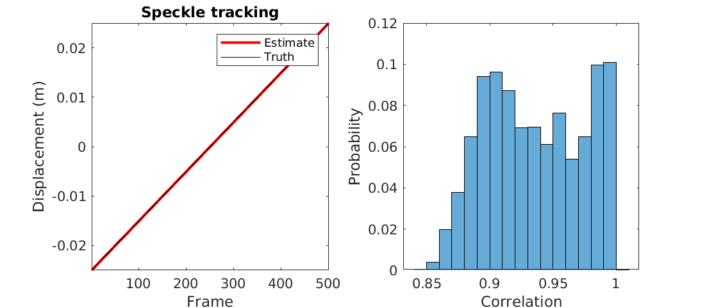
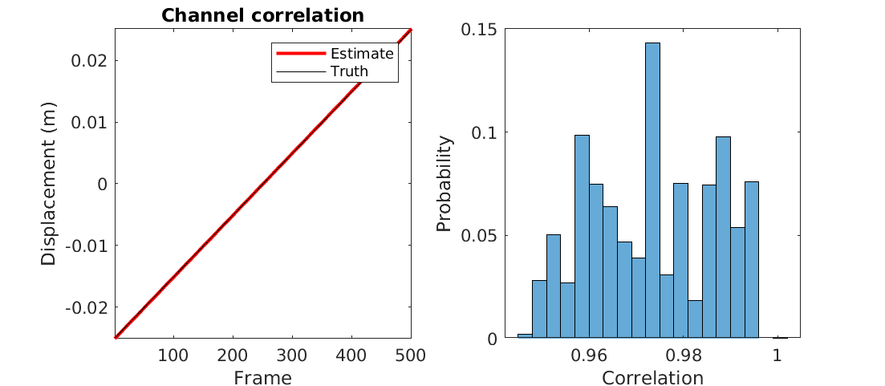

# Lateral ultrasound transducer motion tracking

Analyze ultrasound channel data from pulse echo imaging to estimate lateral displacement of the transducer between frames. This code assumes no axial displacement, as can be achieved with a constrained motion fixture.

This code is based on the algorithms proposed in:

> Bottenus, N. "Implementation of constrained swept synthetic aperture using a mechanical fixture". Applied Sciences, 13(8), April 2023. [Link](https://doi.org/10.3390/app13084797)

If you use the code/algorithm for research, please cite the above paper as appropriate.

You can reference a static version of this code by its DOI number: 

# Sample results

### Simulated data

The following are outputs of the provided sample code, showing estimated displacements with each method and the distribution of correlation coefficients from each tracking.

# The code
The estimation methods described in the paper are provided in the `lateral_speckle_track_wls.m` and `lateral_channel_track_wls.m` files for MATLAB. Supporting functions are provided for calculating normalized cross-correlation coefficients and performing subsample displacement estimation with various methods.

**Please download the sample data under the releases tab for this repository.**

## Sample data

* `planewave_data.mat` - Simulated data of plane wave imaging for the mixed target phantom from the paper, consisting of 501 frames of data at 0.1 mm lateral displacements using a 64 element, 3 MHz transducer with 0.3 mm pitch.
